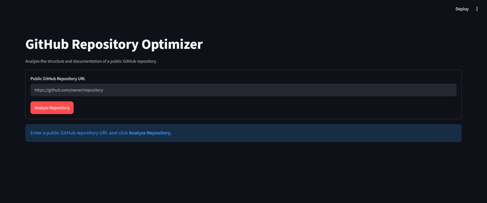
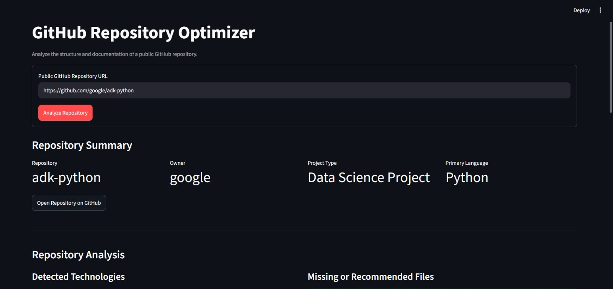

# GitHub Repository Optimizer Agent

[](https://app-repository-optimizer.streamlit.app/)


An AI-powered multi-agent application that fetches and analyzes public GitHub repositories.

The project helps developers understand a repository’s structure, technologies, documentation coverage, and missing baseline project files.

## Features

* Fetches data from public GitHub repositories
* Validates GitHub repository URLs
* Retrieves repository metadata
* Retrieves README content
* Retrieves a bounded repository file tree
* Detects project type and programming language
* Detects basic framework signals
* Identifies missing baseline project files
* Reviews README, LICENSE, CONTRIBUTING, and SECURITY documentation
* Generates structured documentation recommendations
* Uses a Coordinator Agent to combine specialist-agent results
* Includes basic guardrails for invalid URLs, private repositories, and secret masking
* Provides a Streamlit web interface

## Architecture

```text
User
  │
  ▼
Streamlit UI / ADK Interface
  │
  ▼
Coordinator Agent
  ├── Repository Analysis Agent
  │      │
  │      ▼
  │   GitHub Repository Tool
  │
  └── Documentation Analysis Agent
         │
         ▼
      GitHub Repository Tool
              │
              ▼
         GitHub REST API
```

For detailed architecture, see [docs/ARCHITECTURE.md](docs/ARCHITECTURE.md).

## Technology Stack

* Python 3.11+
* Google Agent Development Kit (ADK)
* Gemini API
* GitHub REST API
* Streamlit
* Pydantic
* HTTPX

## Project Structure

```text
github-repository-optimizer-agent/
├── app/
│   ├── agents/
│   │   ├── coordinator_agent.py
│   │   ├── documentation_agent.py
│   │   └── repository_agent.py
│   ├── config/
│   │   └── settings.py
│   ├── guardrails/
│   │   ├── input_policy.py
│   │   └── secret_redaction.py
│   ├── prompts/
│   │   ├── coordinator_prompt.py
│   │   ├── documentation_prompt.py
│   │   └── repository_prompt.py
│   ├── tools/
│   │   └── github_tool.py
│   ├── agent.py
│   └── main.py
├── docs/
│   ├── ARCHITECTURE.md
│   ├── GETTING_STARTED.md
│   └── assets/
├── ui/
│   └── streamlit_app.py
├── requirements.txt
├── pyproject.toml
└── README.md
```

## Installation

See the complete setup guide in [docs/GETTING_STARTED.md](docs/GETTING_STARTED.md).

Quick start:

```powershell
git clone <your-repository-url>
cd github-repository-optimizer-agent

python -m venv .venv
.\.venv\Scripts\Activate.ps1

pip install -r requirements.txt
```

Create `app/.env`:

```env
GOOGLE_API_KEY=your_gemini_api_key
GEMINI_MODEL=gemini-2.5-flash
APP_NAME=github_repository_optimizer
GITHUB_TOKEN=your_optional_read_only_github_token
```

## Run the Application

### Run the Streamlit interface

```powershell
streamlit run ui/streamlit_app.py
```

Open the local URL shown in the terminal, usually:

```text
http://localhost:8501
```

### Run the ADK multi-agent workflow

```powershell
adk run app
```

Example prompt:

```text
Analyze https://github.com/google/adk-python
```

## What the Application Analyzes

### Repository Analysis Agent

* Repository name and owner
* Primary programming language
* Project type
* Framework signals
* Source and test directory signals
* GitHub configuration directory signals
* Missing baseline files and folders

### Documentation Analysis Agent

* README availability and onboarding coverage
* LICENSE file availability
* CONTRIBUTING guide availability
* SECURITY policy availability
* Documentation recommendations

## Guardrails

The application includes basic safety controls:

* Only HTTPS GitHub repository URLs are accepted
* Only public `github.com` repository URLs are supported
* Private repositories are blocked
* Basic API keys, tokens, passwords, and authorization headers are masked in README content
* GitHub API tokens are never shown in the interface or agent output
* Repository file-tree retrieval is limited to protect performance

## Current Limitations

* Only public GitHub repositories are supported
* Repository file trees are limited to a maximum number of entries
* The application does not inspect every source-code file
* The application does not perform vulnerability scanning
* The application does not modify repositories
* The application does not create commits, pull requests, or issues
* Project-type detection uses rule-based heuristics and can be improved

## Screenshots

Add real screenshots after running the application locally.

### Streamlit Home Screen



### Streamlit Analysis Result



## Future Improvements

* Improve project classification logic
* Add code-quality analysis
* Add dependency and security checks
* Add repository scoring
* Add exportable reports
* Add GitHub issue and pull-request recommendation drafts
* Add evaluation datasets and automated tests
* Add deployment configuration

## License

This project is created for educational and portfolio purposes.
