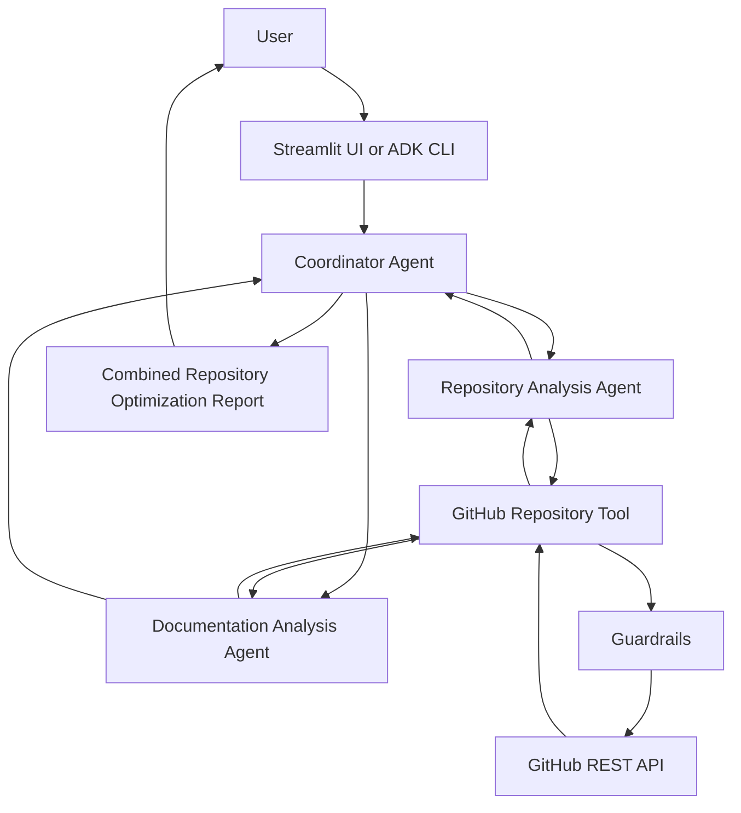

# Architecture Documentation

## Overview

GitHub Repository Optimizer Agent is a read-only multi-agent application for analyzing public GitHub repositories.

The system separates repository retrieval, repository structure analysis, documentation analysis, orchestration, and user interface responsibilities.

## System Architecture



## Components

### Streamlit UI

The Streamlit application provides a simple interface where users can:

1. Enter a public GitHub repository URL.
2. Start repository analysis.
3. View repository structure findings.
4. View documentation findings.
5. View combined recommendations.

The UI directly calls the existing repository and documentation analysis functions to display structured results.

### Coordinator Agent

The Coordinator Agent is the root ADK agent.

Its responsibilities are:

* Receive the user request.
* Delegate repository structure work to the Repository Analysis Agent.
* Delegate documentation work to the Documentation Analysis Agent.
* Combine returned findings.
* Present one evidence-based final report.

The Coordinator does not access GitHub directly.

### Repository Analysis Agent

The Repository Analysis Agent is responsible for:

* Determining project type.
* Detecting primary language.
* Detecting framework signals.
* Checking source, test, and GitHub configuration directories.
* Identifying missing baseline files and folders.

It uses only data returned by the GitHub Repository Tool.

### Documentation Analysis Agent

The Documentation Analysis Agent is responsible for:

* Checking README availability and basic onboarding coverage.
* Checking for LICENSE.
* Checking for CONTRIBUTING guidance.
* Checking for SECURITY policy presence.
* Producing documentation-focused recommendations.

It does not perform security scanning or source-code analysis.

### GitHub Repository Tool

The GitHub Repository Tool is the read-only integration layer.

It:

* Validates GitHub repository URLs.
* Extracts repository owner and name.
* Calls GitHub REST API endpoints.
* Retrieves repository metadata.
* Retrieves README content when available.
* Retrieves a bounded recursive file tree.
* Returns structured data for agents.

### Guardrails

Guardrails are applied before repository data reaches the agents.

They include:

* HTTPS-only URL validation.
* Public `github.com` repository restriction.
* Private repository blocking.
* Basic secret masking for common token and credential patterns.
* Safe error handling.

## Data Flow

```text
1. User enters a public GitHub repository URL.
2. Input policy validates the URL.
3. GitHub Repository Tool fetches repository metadata, README, and file tree.
4. Secret redaction masks basic credential patterns from README content.
5. Repository Analysis Agent creates structure findings.
6. Documentation Analysis Agent creates documentation findings.
7. Coordinator Agent merges specialist outputs.
8. Streamlit UI or ADK CLI presents the result.
```

## Security Boundaries

The application is intentionally read-only.

It does not:

* Clone repositories.
* Modify GitHub files.
* Create commits.
* Create pull requests.
* Access private repositories.
* Expose tokens or API keys.
* Execute repository source code.

## Design Decisions

### Public repositories only

Restricting analysis to public repositories reduces privacy risk and avoids complex authentication and permission management.

### Read-only GitHub integration

The GitHub tool only retrieves metadata and content required for analysis. No write operations are available.

### Specialized agents

Repository structure and documentation analysis are separated because they have different responsibilities and output types.

### Coordinator pattern

The Coordinator Agent centralizes user interaction and report generation while delegating specialized work to sub-agents.

### Structured outputs

Pydantic models are used to return predictable structured data that can be consumed by agents, the UI, tests, and future reporting features.
